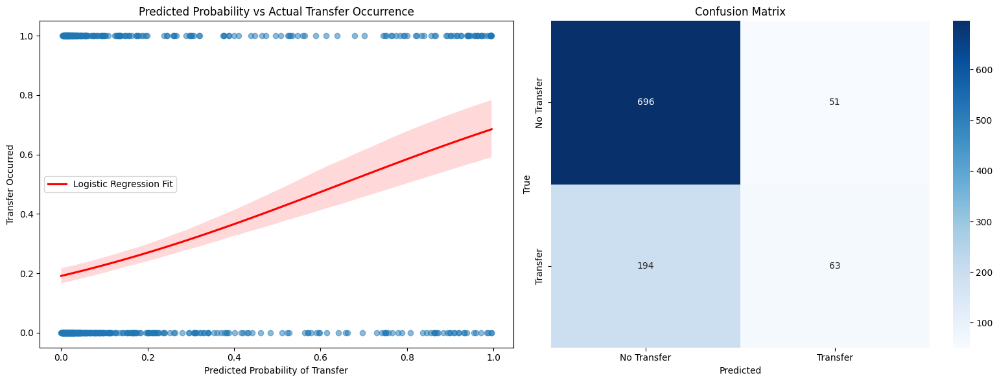

# TransferNet: Mapping the Football Transfer Ecosystem

TransferNet is the final project for the Machine Learning and Network Science (MLNS) course at CentraleSupélec. The objective of this project is to model the football transfer market as a directed, weighted graph, where clubs are represented as nodes and player transfers as edges, weighted by transfer fees or frequency. Using network science and graph-based machine learning, TransferNet analyzes transfer dynamics to identify influential clubs, detect hidden transfer communities, predict future player movements, and visualize complex patterns. The project leverages the Football Transfers Dataset by d2ski et al. to provide actionable insights for football clubs, analysts, and federations.

## What Was Accomplished

- **Data Preprocessing**: The raw dataset was cleaned to remove duplicates, standardize transfer directions, and aggregate transfers at the club level. This produced a structured dataset with columns for season, club IDs, names, countries, total transfer fees, and loan ratios.
- **Graph Construction**: A directed, weighted graph was built, with clubs as nodes and transfers as edges. Edge weights reflect total transfer fees per season, enabling analysis of financial flows in the transfer market.
- **Network Analysis**:
  - **Centrality Measures**: PageRank, Betweenness, and Closeness Centrality were computed to identify influential clubs. For example, clubs like Paris Saint-Germain and Manchester City emerged as key hubs due to their high PageRank scores, indicating significant transfer activity.
  - **Community Detection**: The Louvain algorithm was applied to detect transfer clusters, revealing communities corresponding to major leagues (e.g., English Premier League, La Liga) in the 2022 season.
- **Predictive Modeling**: Graph-based machine learning models (Random Forest, Logistic Regression, Gradient Boosting) were trained for link prediction to forecast future transfers. 

These analyses provide insights into the structural and temporal dynamics of the transfer market, enabling stakeholders to optimize scouting, identify talent pipelines, and monitor market trends.

## Authors
- Ilyess Doragh
- Matthieu Neau
- Clément Leprêtre
- Benjamin Boutier

CentraleSupélec, Paris, France